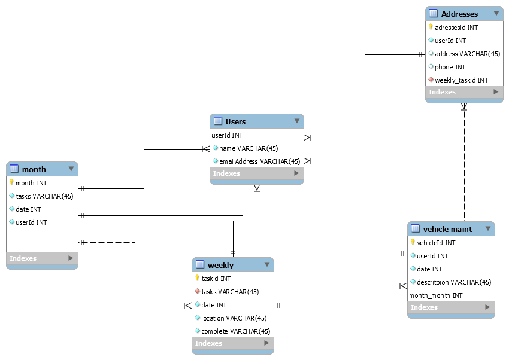

Daily Planner Capstone project
The Daily planner will allow users to use an app instead of a bulky paper planner to keep track of all of the things you would normally see in a day planner. It will keep basic information about tasks, appointments, vehicle maintenance and an address book all in one place.
 This project is a digital day planner. It will allow the user to create an account and use the tools in the app to organize their month and week.

Details:

The planner will have a month at a glance view and a weekly view. A section for names and addresses. A section for vehicle maintenance records and a monthly budget section.

The weekly view will have a to do list that will also show up on the monthly view.
All entries can be edited and deleted.

The Api’s will be databases created by the user when they enter in the information.

Stretch goals--adding an outside API that populates the monthly calendar with daily weather information.
A checkbox to check of tasks in the to do list instead of just deleting them
Populating the monthly view with the tasks from the weekly view and those tasks show they are checked off when they are completed.
Addin other sections to the journal-like a grocery list.

components:
monthly calendar where you can mark off days
weekly view with a task list
vehicle maintenance tracker
address book

The task list will have information-the information in state
the information from that list will be passed as props to the monthly and weekly views.

The address book will have information that is pased as props to the weekly view. As detiled information for appointments.

The vehilce maintenance section will pass information to the monthly view and the weekly view.

